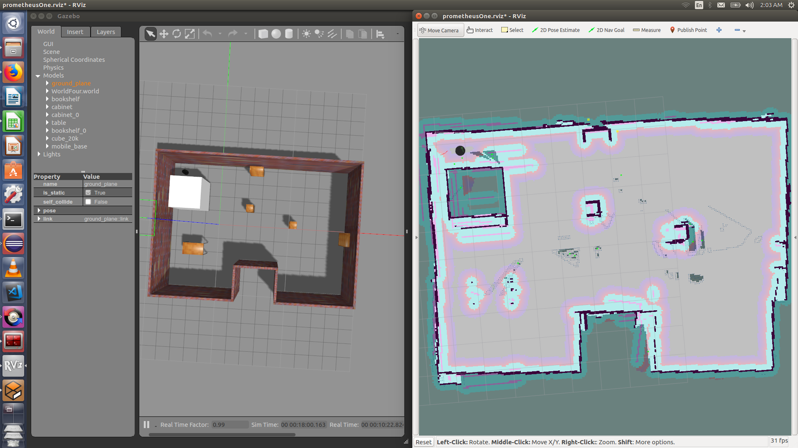
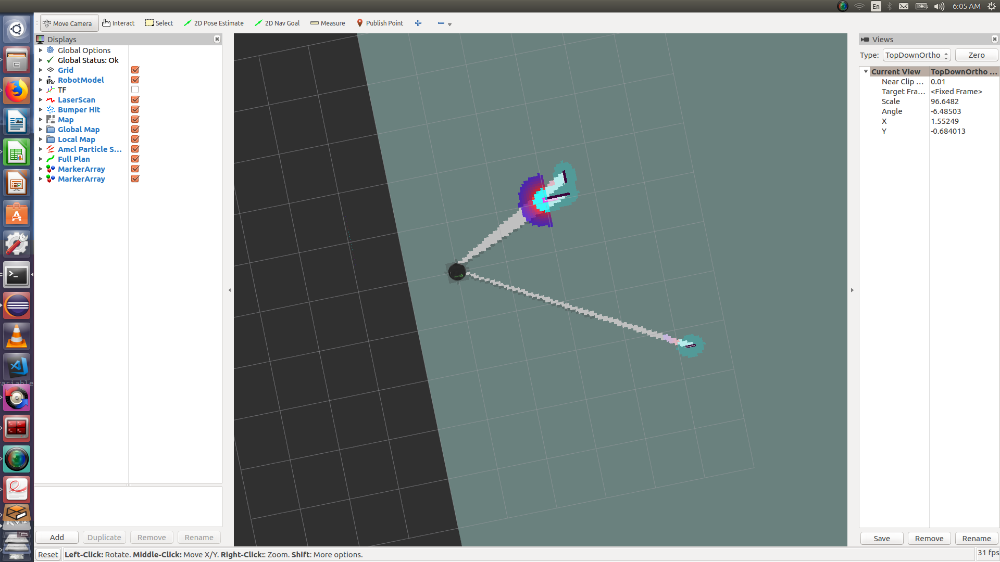
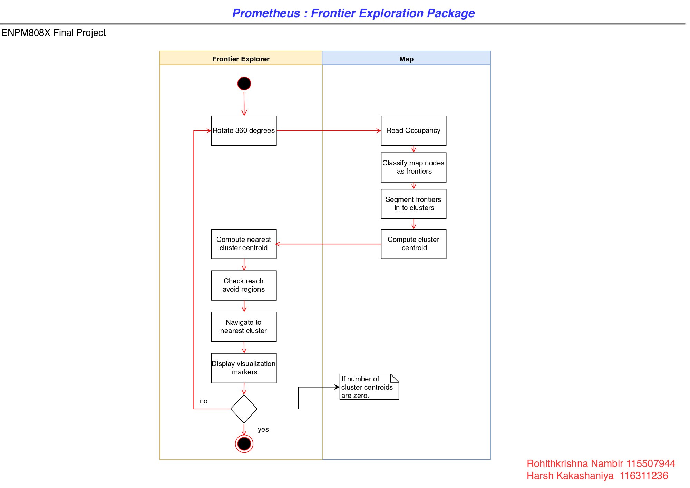
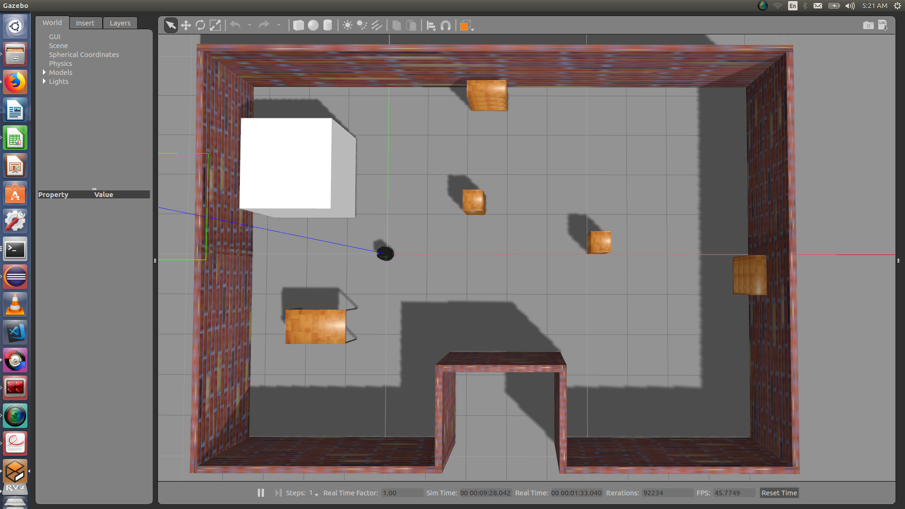

<h1 align="center"> Prometheus - Frontier Exploration Package</h1>

[](https://travis-ci.org/rohit517/prometheus_frontier_explorer)
[](https://github.com/rohit517/prometheus_frontier_explorer/blob/master/LICENSE)

## Overview



Prometheus is a frontier exploration package in ROS. This was developed as a part of ENPM808X Software Development course at the University of Maryland, College Park.
Frontier exploration is the method of exploring unknown environments autonomously. Prometheus uses the turtlebot platform for simulation and implementing the frontier exploration package. 

## Development Process

We will use pair programming for all the design and development purpose. The planning and development of this module has been split into three sprints of a week each. 
The product backlog, work log and iteration log can be found in the link below. Test Driven Development approach is taken for implementation and unit testing. 
This will enable us to complete the project in defined time. At the end, we will have report of actual time and planned time difference. This will enable future ventures 
to plan correctly.

[Product Backlog](https://docs.google.com/spreadsheets/d/1WyqjxLJYhD7yKD_-subkLtXecHzkrexpV9mALVQkXeg/edit?usp=sharing) <br />
[Sprint Planning Notes](https://docs.google.com/document/d/1KBs8nIbSC2j8wkA-MLAoiLhvDDQ5_QhBMDhgUkwR7bk/edit?usp=sharing)

## Dependencies
For running prometheus we must have the following dependencies:

- Ubuntu 16.04
- ROS Kinetic 
- Turtlebot package.
- Gazebo version 7.0 or higher.

ROS Kinetic can be installed by following the instructions given [here](http://wiki.ros.org/kinetic/Installation). Gazebo installation steps can be found [here](http://gazebosim.org/tutorials?cat=guided_b&tut=guided_b1). 
 
## License
```
/*
 BSD 3-Clause License
 Copyright (c) 2018, Rohitkrishna Nambiar,  Harsh Kakashaniya
 All rights reserved.
 Redistribution and use in source and binary forms, with or without
 modification, are permitted provided that the following conditions are met:
 * Redistributions of source code must retain the above copyright notice, this
 list of conditions and the following disclaimer.
 * Redistributions in binary form must reproduce the above copyright notice,
 this list of conditions and the following disclaimer in the documentation
 and/or other materials provided with the distribution.
 * Neither the name of the copyright holder nor the names of its
 contributors may be used to endorse or promote products derived from
 this software without specific prior written permission.
 THIS SOFTWARE IS PROVIDED BY THE COPYRIGHT HOLDERS AND CONTRIBUTORS "AS IS"
 AND ANY EXPRESS OR IMPLIED WARRANTIES, INCLUDING, BUT NOT LIMITED TO, THE
 IMPLIED WARRANTIES OF MERCHANTABILITY AND FITNESS FOR A PARTICULAR PURPOSE ARE
 DISCLAIMED. IN NO EVENT SHALL THE COPYRIGHT HOLDER OR CONTRIBUTORS BE LIABLE
 FOR ANY DIRECT, INDIRECT, INCIDENTAL, SPECIAL, EXEMPLARY, OR CONSEQUENTIAL
 DAMAGES (INCLUDING, BUT NOT LIMITED TO, PROCUREMENT OF SUBSTITUTE GOODS OR
 SERVICES; LOSS OF USE, DATA, OR PROFITS; OR BUSINESS INTERRUPTION) HOWEVER
 CAUSED AND ON ANY THEORY OF LIABILITY, WHETHER IN CONTRACT, STRICT LIABILITY,
 OR TORT (INCLUDING NEGLIGENCE OR OTHERWISE) ARISING IN ANY WAY OUT OF THE USE
 OF THIS SOFTWARE, EVEN IF ADVISED OF THE POSSIBILITY OF SUCH DAMAGE.
 */
```

## Installation and setup

### Creating a catkin workspace
Create a catkin workspace using following instructions:
```
$ mkdir -p ~/catkin_ws/src
$ cd ~/catkin_ws/src
$ git clone --recursive https://github.com/rohit517/prometheus_frontier_explorer
```
### Build the program
```
cd ~/catkin_ws
catkin_make
```
catkin_make alone does work of cmake command and make command of our Cmake process. After running this we will see two more folders named build and devel.

### Run the Demo

Prometheus exploration package has two launch files. The first one launches Gazebo and Rviz. The second one launches Gmapping and prometheus_demo node. Please note to start the Gazebo+Rviz launch file first. To do this, run the following commands in a new terminal

### In Terminal 1
```
cd ~/catkin_ws
source devel/setup.bash 
roslaunch prometheus_frontier_explorer gazebo_rviz.launch
```
Now that we have launched Gazebo and Rviz, we will next launch our gmapping and prometheus node. To do this, run the following commands in a new terminal. This will start a new terminal which will output messages from the prometheus frontier exploration node. 

### In Terminal 2
```
cd ~/catkin_ws
source devel/setup.bash
roslaunch prometheus_frontier_explorer prometheus_demo.launch
```
If we have correctly launched our setup, Rviz will display partial occupancy grid output as seen below. Please note that this is a representative image for the default map provided in the world folder launched in Gazebo. If you do not see this or the terminal quits, kindly restart the both the launch files. For further issues, please check the known issues/bugs section. 




## Working

The algorithm for the prometheus frontier exploration package can be understood from the activity diagram shown below



We see that, the turtlebot is initially spawned at the origin of the map. The algorithm can be described in the steps below 
- Rotate 360
- Scan and read occupancy grid
- Classify map nodes as frontiers
- Cluster frontiers
- Compute cluster centroids
- Get the closest cluster centroid from the current location of the turtlebot
- Check for possible repetition of goal
- Navigate to goal (nearest cluster centroid)
- Repeat untill no clusters are found

To test this, we have a default gazebo environment(prometheus_world.world) where this turtle bot moves and explores. The enviroment can be seen in the following image



## Test
As we are using continous intergration(CI) process of development. To test the software there are unit test and some ROS test where ever required. To build and run the test we need to execute following commands in a new terminal. The following command builds the tests and executes them
```
cd ~/catkin_ws
catkin_make run_tests
rostest prometheus_frontier_explorer prometheusTests.launch
```
which will give similar results
```
[ROSTEST]-----------------------------------------------------------------------

[prometheus_frontier_explorer.rosunit-prometheusTests/testAllMarkerPublish][passed]
[prometheus_frontier_explorer.rosunit-prometheusTests/testFrontierSegmentedPublish][passed]
[prometheus_frontier_explorer.rosunit-prometheusTests/testFrontierClusteredPublish][passed]
[prometheus_frontier_explorer.rosunit-prometheusTests/testReachAvoidPublish][passed]
[prometheus_frontier_explorer.rosunit-prometheusTests/testVelPublish][passed]
[prometheus_frontier_explorer.rosunit-prometheusTests/testGridSubscriber][passed]
[prometheus_frontier_explorer.rosunit-prometheusTests/testSetX][passed]
[prometheus_frontier_explorer.rosunit-prometheusTests/testSetY][passed]
[prometheus_frontier_explorer.rosunit-prometheusTests/testSetProbability][passed]
[prometheus_frontier_explorer.rosunit-prometheusTests/testSetIsFrontier][passed]
[prometheus_frontier_explorer.rosunit-prometheusTests/testSetFrontierIndex][passed]
[prometheus_frontier_explorer.rosunit-prometheusTests/testGetX][passed]
[prometheus_frontier_explorer.rosunit-prometheusTests/testGetY][passed]
[prometheus_frontier_explorer.rosunit-prometheusTests/testGetProbability][passed]
[prometheus_frontier_explorer.rosunit-prometheusTests/testGetIsFrontier][passed]
[prometheus_frontier_explorer.rosunit-prometheusTests/testGetFrontierIndex][passed]
[prometheus_frontier_explorer.rosunit-prometheusTests/testGridToMap][passed]
[prometheus_frontier_explorer.rosunit-prometheusTests/testGetFrontiers][passed]
[prometheus_frontier_explorer.rosunit-prometheusTests/testGetClusters][passed]
[prometheus_frontier_explorer.rosunit-prometheusTests/testGetClusterCentroids][passed]
[prometheus_frontier_explorer.rosunit-prometheusTests/testSetMapSet][passed]
[prometheus_frontier_explorer.rosunit-prometheusTests/testSetMapHeight][passed]
[prometheus_frontier_explorer.rosunit-prometheusTests/testSetMapWidth][passed]
[prometheus_frontier_explorer.rosunit-prometheusTests/testSetMapReso][passed]
[prometheus_frontier_explorer.rosunit-prometheusTests/testSetOrigin][passed]
[prometheus_frontier_explorer.rosunit-prometheusTests/testGetMapSet][passed]
[prometheus_frontier_explorer.rosunit-prometheusTests/testGetMapHeight][passed]
[prometheus_frontier_explorer.rosunit-prometheusTests/testGetMapWidth][passed]
[prometheus_frontier_explorer.rosunit-prometheusTests/testGetMapReso][passed]
[prometheus_frontier_explorer.rosunit-prometheusTests/testGetOrigin][passed]

SUMMARY
 * RESULT: SUCCESS
 * TESTS: 30
 * ERRORS: 0
 * FAILURES: 0
```
## Building for code coverage
```
sudo apt-get install lcov
cmake -D COVERAGE=ON -D CMAKE_BUILD_TYPE=Debug ../
make
make code_coverage
```
This generates a index.html page in the build/coverage sub-directory that can be viewed locally in a web browser.

## Doxygen Documentation

Doxygen Documentation generation steps:
```
cd <path to repository>
mkdir Doxygen
cd Doxygen
doxygen -g <config_file_name>
```

Open configuration file and update the following:

```
PROJECT_NAME = 'your project name'
INPUT = ../src ../include ../test
```

Run and generate the documents by running the next command:
```
doxygen <config_file_name>
```

## Known issues/bugs
- Always start the Gazebo+Rviz launch file before starting Gmapping+Prometheus node. Sometimes starting the Gmapping node does not start the mapping process in Rviz. In this case restart both the nodes. Once started, Gmapping terminal output snippet will appear similar to the following.  In Rviz, if we are able to visualize a scan, our node has spawned correct.
```
[ INFO] [1544870500.506398053, 482.380000000]: Initialization complete
update frame 0
update ld=0 ad=0
Laser Pose= -0.0870112 0.0474794 0.00159126
m_count 0
Registering First Scan
[ INFO] [1544870500.677827802, 482.552000000]: Resizing costmap to 320 X 512 at 0.050000 m/pix
[ INFO] [1544870500.778639624, 482.652000000]: Received a 320 X 512 map at 0.050000 m/pix
[ INFO] [1544870500.784053640, 482.658000000]: Using plugin "obstacle_layer"
[ INFO] [1544870500.787262484, 482.661000000]:     Subscribed to Topics: scan bump
[ INFO] [1544870500.851977878, 482.724000000]: Using plugin "inflation_layer"
[ INFO] [1544870500.931948727, 482.802000000]: Using plugin "obstacle_layer"
[ INFO] [1544870500.935972126, 482.806000000]:     Subscribed to Topics: scan bump
[ INFO] [1544870500.999362098, 482.869000000]: Using plugin "inflation_layer"
[ INFO] [1544870501.070789289, 482.939000000]: Created local_planner dwa_local_planner/DWAPlannerROS
[ INFO] [1544870501.074831351, 482.943000000]: Sim period is set to 0.20
[ INFO] [1544870502.074932652, 483.936000000]: Recovery behavior will clear layer obstacles
[ INFO] [1544870502.082048824, 483.943000000]: Recovery behavior will clear layer obstacles
[ INFO] [1544870502.137028183, 483.995000000]: odom received!
``` 

## Termination
Press Ctrl+C in both the terminals running Gazebo and Gmapping + Prometheus node.`


## Authors/About Us
Harsh Kakashaniya ([harshkakashaniya](https://github.com/harshkakashaniya)) - I am a Masters of Engineering in Robotics student at the University of Maryland, College Park. I am intereted in mobile robots.<br />
Rohitkrishna Nambiar ([rohit517](https://github.com/rohit517)) - I am a Masters of Engineering in Robotics student at the University of Maryland, College Park. I am intereted in computer vision and machine learning for autonomous robots.
